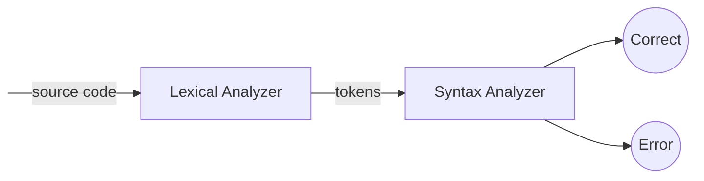

# Rat24S Compiler
A compiler for Rat24S language is designed to be an easy to understand. It has a short grammar and relatively clean semantics.

## Usage
Here is a simple example of checking a source code file for syntax errors, and print out to the console all the production rules used during syntax analyzing:
```bash
python3 rat24s.py input.txt -o output.txt -v
```
**Optional arguments**
The Rat24S compiler has many options for reading input from a file, writing output to a file, extracting the tokens, and checking your code syntax.
|Flag|Full tag|Description|
|--|--|--|
|`-o`|`--output`|Output file path.|
|`-t`|`--tokens`|Extract tokens only, but don't do anything beyond that.|
|`-v`|`--verbose`|Enable verbose mode.|

# Documentations
#### High level diagram

#### Grammar Rules
```
R1. <Rat24S> ::=  $ <Opt Function Definitions>  $ <Opt Declaration List> $ <Statement List> $
R2. <Opt Function Definitions> ::= <Function Definitions>  | <Empty>
R3. <Function Definitions> ::= <Function> | <Function> <Function Definitions>
R4. <Function> ::= function <Identifier>  ( <Opt Parameter List> ) <Opt Declaration List> <Body>
R5. <Opt Parameter List> ::= <Parameter List>  |  <Empty>
R6. <Parameter List> ::= <Parameter>  |  <Parameter> , <Parameter List>
R7. <Parameter> ::= <IDs > <Qualifier>
R8. <Qualifier> ::= integer  |  boolean  | real
R9. <Body> ::= { < Statement List> }
R10. <Opt Declaration List> ::= <Declaration List>  |  <Empty>
R11. <Declaration List> := <Declaration> ;  |  <Declaration> ; <Declaration List>
R12. <Declaration> ::=  <Qualifier > <IDs>
R13. <IDs> ::=  <Identifier>  | <Identifier>, <IDs>
R14. <Statement List> ::=  <Statement>  | <Statement> <Statement List>
R15. <Statement> ::=  <Compound> | <Assign> |  <If> | <Return>  | <Print>  |  <Scan>  | <While>
R16. <Compound> ::=  { <Statement List> }
R17. <Assign> ::=  <Identifier> = <Expression> ;
R18. <If> ::=  if ( <Condition> ) <Statement>  endif  |  if ( <Condition> ) <Statement>  else <Statement> endif
R19. <Return> ::= return ; | return <Expression> ;
R20. <Print> ::=  print ( <Expression>);
R21. <Scan> ::=  scan ( <IDs> );
R22. <While> ::= while ( <Condition> ) <Statement> endwhile
R23. <Condition> ::=  <Expression> <Relop>  <Expression>
R24. <Relop> ::=  ==  |  !=  |  >  |  <  | <=  |  =>
R25. <Expression> ::=  <Expression> + <Term>  | <Expression> - <Term>  |  <Term>
R26. <Term>  ::=  <Term> * <Factor>  |  <Term> / <Factor>  |  <Factor>
R27. <Factor> ::=  - <Primary>  |  <Primary>
R28. <Primary> ::=  <Identifier> | <Integer> |  <Identifier> ( <IDs> )  |  ( <Expression> )  |  
<Real> |  true  | false
R29. <Empty>  ::= ε
```

# License
This project is licensed under the MIT license - see the [LICENSE.md](LICENSE.md) file for details.